# 実行計画書（Execution Plan）

**プロジェクト名**: 恋愛自動操縦  
**作成日**: 2026-05-04  
**バージョン**: v2  
**ステータス**: レビュー待ち

---

## 1. スコープ・影響分析

### 変更影響範囲

| 影響領域 | 有無 | 内容 |
|---|---|---|
| ユーザー向け変更 | あり | 全機能がユーザー体験に直結 |
| 構造的変更 | あり | 新規システム構築（Greenfield） |
| データモデル変更 | あり | ユーザー・会話・実績・スコアデータの設計が必要 |
| API変更 | あり | フロントエンド ↔ バックエンド間のAPI設計が必要 |
| NFR影響 | あり | AI応答速度・データプライバシーの考慮が必要 |

### リスク評価

| 項目 | 評価 | 理由 |
|---|---|---|
| リスクレベル | 中 | 新規構築のプロトタイプ。スコープを絞ることでリスクを管理する |
| ロールバック難易度 | 低 | Greenfieldのため既存への影響なし |
| テスト複雑度 | 中 | AI生成の品質検証が必要 |

---

## 2. ワークフロー可視化

```mermaid
flowchart TD
    Start(["START"])

    subgraph INCEPTION["INCEPTION PHASE - Planning"]
        WD["Workspace Detection\nCOMPLETED"]
        RE["Reverse Engineering\nSKIP"]
        RA["Requirements Analysis\nCOMPLETED"]
        US["User Stories\nCOMPLETED"]
        WP["Workflow Planning\nCOMPLETED"]
        AD["Application Design\nCOMPLETED"]
        UG["Units Generation\nCOMPLETED"]
    end

    subgraph CONSTRUCTION["CONSTRUCTION PHASE - Implementation"]
        subgraph U1["Unit 1 - AI Message Engine"]
            FD1["Functional Design"]
            NFR1["NFR Requirements"]
            CG1["Code Generation"]
        end
        subgraph U2["Unit 2 - Conversation Route Engine"]
            FD2["Functional Design"]
            NFR2["NFR Requirements"]
            CG2["Code Generation"]
        end
        subgraph U3["Unit 3 - Persona Analysis Engine"]
            FD3["Functional Design"]
            CG3["Code Generation"]
        end
        subgraph U4["Unit 4 - User Auth"]
            FD4["Functional Design"]
            CG4["Code Generation"]
        end
        subgraph U5["Unit 5 - Character Settings"]
            FD5["Functional Design"]
            CG5["Code Generation"]
        end
        subgraph U6["Unit 6 - Results and Report"]
            FD6["Functional Design"]
            CG6["Code Generation"]
        end
        subgraph U7["Unit 7 - Score and Ranking"]
            FD7["Functional Design"]
            CG7["Code Generation"]
        end
        subgraph U8["Unit 8 - Frontend UI"]
            FD8["Functional Design"]
            CG8["Code Generation"]
        end
        subgraph U9["Unit 9 - AWS Infrastructure"]
            ID9["Infrastructure Design"]
            CG9["Code Generation"]
        end
        BT["Build and Test\nEXECUTE"]
    end

    subgraph OPERATIONS["OPERATIONS PHASE"]
        OPS["Operations\nPLACEHOLDER"]
    end

    Start --> WD --> RE --> RA --> US --> WP --> AD --> UG
    UG --> FD1 --> NFR1 --> CG1
    CG1 --> FD2 --> NFR2 --> CG2
    CG2 --> FD3 --> CG3
    CG3 --> FD4 --> CG4
    CG4 --> FD5 --> CG5
    CG5 --> FD6 --> CG6
    CG6 --> FD7 --> CG7
    CG7 --> FD8 --> CG8
    CG8 --> ID9 --> CG9
    CG9 --> BT --> OPS
    BT --> End(["COMPLETE"])

    style Start fill:#CE93D8,stroke:#6A1B9A,stroke-width:3px,color:#000
    style End fill:#CE93D8,stroke:#6A1B9A,stroke-width:3px,color:#000
    style WD fill:#4CAF50,stroke:#1B5E20,stroke-width:3px,color:#fff
    style RA fill:#4CAF50,stroke:#1B5E20,stroke-width:3px,color:#fff
    style WP fill:#4CAF50,stroke:#1B5E20,stroke-width:3px,color:#fff
    style BT fill:#4CAF50,stroke:#1B5E20,stroke-width:3px,color:#fff
    style RE fill:#BDBDBD,stroke:#424242,stroke-width:2px,stroke-dasharray:5 5,color:#000
    style OPS fill:#BDBDBD,stroke:#424242,stroke-width:2px,stroke-dasharray:5 5,color:#000
    style US fill:#4CAF50,stroke:#1B5E20,stroke-width:3px,color:#fff
    style AD fill:#4CAF50,stroke:#1B5E20,stroke-width:3px,color:#fff
    style WP fill:#4CAF50,stroke:#1B5E20,stroke-width:3px,color:#fff
    style UG fill:#4CAF50,stroke:#1B5E20,stroke-width:3px,color:#fff
    style FD1 fill:#FFA726,stroke:#E65100,stroke-width:2px,color:#000
    style NFR1 fill:#FFA726,stroke:#E65100,stroke-width:2px,color:#000
    style CG1 fill:#4CAF50,stroke:#1B5E20,stroke-width:2px,color:#fff
    style FD2 fill:#FFA726,stroke:#E65100,stroke-width:2px,color:#000
    style NFR2 fill:#FFA726,stroke:#E65100,stroke-width:2px,color:#000
    style CG2 fill:#4CAF50,stroke:#1B5E20,stroke-width:2px,color:#fff
    style FD3 fill:#FFA726,stroke:#E65100,stroke-width:2px,color:#000
    style CG3 fill:#4CAF50,stroke:#1B5E20,stroke-width:2px,color:#fff
    style FD4 fill:#FFA726,stroke:#E65100,stroke-width:2px,color:#000
    style CG4 fill:#4CAF50,stroke:#1B5E20,stroke-width:2px,color:#fff
    style FD5 fill:#FFA726,stroke:#E65100,stroke-width:2px,color:#000
    style CG5 fill:#4CAF50,stroke:#1B5E20,stroke-width:2px,color:#fff
    style FD6 fill:#FFA726,stroke:#E65100,stroke-width:2px,color:#000
    style CG6 fill:#4CAF50,stroke:#1B5E20,stroke-width:2px,color:#fff
    style FD7 fill:#FFA726,stroke:#E65100,stroke-width:2px,color:#000
    style CG7 fill:#4CAF50,stroke:#1B5E20,stroke-width:2px,color:#fff
    style FD8 fill:#FFA726,stroke:#E65100,stroke-width:2px,color:#000
    style CG8 fill:#4CAF50,stroke:#1B5E20,stroke-width:2px,color:#fff
    style ID9 fill:#FFA726,stroke:#E65100,stroke-width:2px,color:#000
    style CG9 fill:#4CAF50,stroke:#1B5E20,stroke-width:2px,color:#fff
    style INCEPTION fill:#BBDEFB,stroke:#1565C0,stroke-width:2px,color:#000
    style CONSTRUCTION fill:#C8E6C9,stroke:#2E7D32,stroke-width:2px,color:#000
    style OPERATIONS fill:#FFF59D,stroke:#F57F17,stroke-width:2px,color:#000
    style U1 fill:#E8F5E9,stroke:#388E3C,stroke-width:1px,color:#000
    style U2 fill:#E8F5E9,stroke:#388E3C,stroke-width:1px,color:#000
    style U3 fill:#E8F5E9,stroke:#388E3C,stroke-width:1px,color:#000
    style U4 fill:#E8F5E9,stroke:#388E3C,stroke-width:1px,color:#000
    style U5 fill:#E8F5E9,stroke:#388E3C,stroke-width:1px,color:#000
    style U6 fill:#E8F5E9,stroke:#388E3C,stroke-width:1px,color:#000
    style U7 fill:#E8F5E9,stroke:#388E3C,stroke-width:1px,color:#000
    style U8 fill:#E8F5E9,stroke:#388E3C,stroke-width:1px,color:#000
    style U9 fill:#FFF3E0,stroke:#E65100,stroke-width:1px,color:#000

    linkStyle default stroke:#555,stroke-width:2px
```



### 凡例

| 色 | 意味 |
|---|---|
| 緑（塗りつぶし） | 完了 / 必須実行 / Code Generation |
| オレンジ | 実行予定（Functional Design / NFR / Infrastructure Design） |
| グレー（破線） | スキップ / プレースホルダー |
| 紫 | 開始 / 終了 |

---

## 3. 実行フェーズ詳細

### INCEPTION PHASE

| ステージ | 判断 | 理由 |
|---|---|---|
| ワークスペース検出 | 完了 | Greenfield確認済み |
| リバースエンジニアリング | スキップ | Greenfieldのため不要 |
| 要件分析 | 完了 | requirements.md v2作成済み |
| ユーザーストーリー | 完了 | personas.md・stories.md（13ストーリー）作成済み |
| ワークフロープランニング | 完了 | execution-plan.md v2作成済み |
| アプリケーション設計 | 完了（承認待ち） | application-design/ 配下5ファイル作成済み |
| Unit分解 | 実行予定 | 9 Unitに分割予定 |

### CONSTRUCTION PHASE（Unit別）

| Unit | 内容 | 機能設計 | NFR要件 | インフラ設計 | コード生成 |
|---|---|---|---|---|---|
| Unit 1 | AIメッセージ生成エンジン | 実行 | 実行（AI応答速度） | - | 実行 |
| Unit 2 | 会話ルート設計エンジン | 実行 | 実行（AI応答速度） | - | 実行 |
| Unit 3 | 相手ペルソナ分析エンジン | 実行 | - | - | 実行 |
| Unit 4 | ユーザー管理・認証 | 実行 | - | - | 実行 |
| Unit 5 | キャラクター設定管理 | 実行 | - | - | 実行 |
| Unit 6 | 実績トラッキング・レポート | 実行 | - | - | 実行 |
| Unit 7 | 舐めプスコア・指名ランキング | 実行 | - | - | 実行 |
| Unit 8 | フロントエンド UI | 実行 | - | - | 実行 |
| Unit 9 | AWSインフラ構成 | - | - | 実行 | 実行 |

---

## 4. Unit構成詳細

```
Unit 1: AIメッセージ生成エンジン
  - Amazon Bedrockを使った最初のメッセージ生成
  - キャラクター設定 + ペルソナ分析 + ゴールを組み合わせてパーソナライズ
  - 複数パターン生成・ユーザー選択
  - AWS Lambda + API Gateway

Unit 2: 会話ルート設計エンジン
  - ゴールまでの会話シナリオ生成・返信予測
  - 返信が来たときの練り直し機能
  - 離脱ポイントの記録
  - AWS Lambda + API Gateway

Unit 3: 相手ペルソナ分析エンジン
  - 相手のプロフィール文をBedrockで分析
  - 性格傾向・価値観・コミュニケーションスタイルを推定
  - 分析結果をUnit 1・2に連携
  - AWS Lambda + API Gateway

Unit 4: ユーザー管理・認証
  - Amazon Cognitoによる認証
  - ユーザープロフィール管理
  - DynamoDB（ユーザーテーブル）

Unit 5: キャラクター設定管理
  - 話し方・趣味・成功パターンの登録・更新
  - Unit 1・2のAI生成に反映
  - DynamoDB（キャラクターテーブル）

Unit 6: 実績トラッキング・レポート
  - 返信率・離脱ポイント・会えた実績の記録
  - ゲーミフィケーション（ポイント・バッジ）
  - 会話終了後の振り返りレポート自動生成（Bedrock）
  - DynamoDB（実績テーブル）

Unit 7: 舐めプスコア・指名ランキング
  - 軸1：舐めプ度（AIを使うたびに加算）
  - 軸2：指名数（コピーされるたびに加算）
  - 指名ランキング（指名数が多いほど上位）
  - DynamoDB（スコアテーブル）

Unit 8: フロントエンド UI
  - Next.js（TypeScript）
  - 「ダメになっていく」演出UI
  - 各Unit APIとの連携
  - AWS Amplify でホスティング

Unit 9: AWSインフラ構成
  - AWS CDK（TypeScript）によるIaC
  - Lambda・API Gateway・DynamoDB・Cognito・Amplifyの構成定義
  - 環境変数・シークレット管理
```

---

## 5. 成功基準

| 基準 | 内容 |
|---|---|
| 主目標 | Inceptionフェーズドキュメントの完成 + 動作するプロトタイプ（可能な範囲） |
| 主要成果物 | GitHubリポジトリ（公開）+ aidlc-docs/ 配下の全ドキュメント |
| 品質ゲート | 各Unitの設計書レビュー完了 |
| プロジェクト目標 | 4つの設計観点すべてにドキュメントで対応 |

---

## 6. 変更履歴

| 日付 | バージョン | 内容 |
|---|---|---|
| 2026-05-04 | v1 | 初版作成（4 Unit構成） |
| 2026-05-04 | v2 | 9 Unit構成に拡張。新機能（ペルソナ分析・レポート・スコア）を反映 |
| 2026-05-04 | v3 | Mermaid図・テーブルを最新進捗に更新。Unit 7名を「舐めプスコア・指名ランキング」に修正 |
